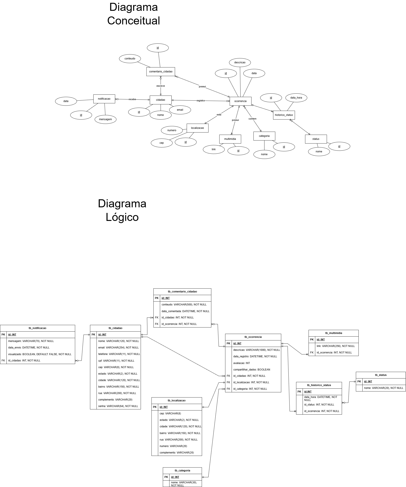

# Reporter do meu Bairro.


> Projeto integrado referente a ideia de um produto que atenda as necessidades da população e interligando o conhecimento de problemas públicos presentes da população local com as prefeituras para ações de monitoramento, mitigação e controle de danos dessas ocorrências.

## Estrutura do repositório:
O projeto tem uma organização no estilo monorepositório, tendo em vista a seguinte estrutura:
- **[`/frontend`](./frontend)**: *Aplicação SPA desenvolvida utilizando Html, Css e JavaScript.*
- **[`/backend`](./backend)**: *API REST desenvolvida utilizando de Node.js(Express) e utilizando prisma para comunicação com o database.*
- **[`/database`](./database)**: *Scripts de criação do banco de dados e triggers. Scripts de Inserção de informações diretamente ao banco.*
- **[`/documentacao`](./documentacao)**: *Documentação de requisitos da aplicação.*
  
## 💻 Pré-requisitos

Antes de começar, verifique se você atendeu aos seguintes requisitos:

- Você instalou a versão das dependencias backend :
``` bash
npm i
```
- Você leu o [TAP - PROJETO](https://github.com/GuilhermeVianadeSouza/Projeto-Intregado-Senai/wiki/TAP-%E2%80%90-PROJETO).

## ☕ Usando reporter do meu bairro.

Para usar reporter do meu bairro, siga estas etapas:

```
 Inicie a aplicação backend em uma janela diferente do vscode.
 - Utilize a expressão: node app.js para a inicialização do BACK.
 Após isso, em uma janela nova do vscode utilize a extensão go live.
 Na tela de login insira o seguinte login para teste:
 - "carlos.souza@email.com" e utilize a senha: "senha456".
 - "maria.oliveira@email.com" e utilize a senha: "segredo1"

  Aplicação estará em seu total uso!
```

## Frontend

A interface foi construída com foco em intuitividade e responsividade tendo um dinamismo em sua funcionalidade.

**Tecnologias utilizadas:**
- HTML5 & CSS3
- JavaScript (ES6+)

**Telas Principais:**

| Tela de Login | Feed de ocorrências | Criação de ocorrencia | Visualizar minhas ocorrências |
|:---:|:---:|:---:|:---:|
|  |  |

**Funcionalidades:**
- [x] Cadastro e login de usuário (Cidadão).
- [x] Visualização de ocorrências.
- [x] Filtragem a partir de localização, data, status e categoria de ocorrências.
- [x] Visualização das ocorrências realizadas pelo próprio usuário
- [x] Registro de uma nova ocorrência (Com todas as informações necessárias, incluindo o registro de fotos.)
- [x] Registro de localização e utilização de API externa para preenchimento de alguns campos (Viacep.)
- [x] Visualizar perfil.

**Digrama (DER):**


**Integração e APIs Externas:**
A aplicação além de se comunicar com o Backend da aplicação, ele consome as APIs:
- **[viacep](https://viacep.com.br/):** Utilizada no formulario de cadastro de localização e no cadastro de usuário
 
## Backend

A API segue os padrões estabelecidos REST e foi estruturada utilizando a arquitetura MVC para organização e escalabilidade.

**Principais Dependências:**
- **Express:** Framework web
- **Cors:** Para configurações dos métodos
- **BodyParser:** configurações do Json recebido;

## Banco de dados

O projeto utilizou-se do banco de dados relacional MySQL gerenciado pelo Prisma ORM.

**Estrutura de Dados:**
* **Cidadão:** Armazena dados referente aos Cidadões;
* **Localização:** Armazena dados referente a uma localização que será utilizada para o registro de ocorrência.
* **Categoria:** Armazena dados referente a uma categoria que será utilizada para o registro de ocorrência.
* **Status:** Armazena dados referente a uma categoria que será utilizada para o registro do histórico de uma ocorrência.
* **Ocorrência:** Armazena dados referente a uma ocorrência. Essa tabela recebe atributos de outras tabelas.
* **Multimidia:** Armazena dados referente a fotos/videos de uma ocorrência
* **Histórico Status:** Armazena o histórico de mudança de status de uma ocorrência.
* **Comentario cidadão:** Armazenas dados referentes dos comentários de uma ocorrência.
* **Notificação:** Armazenas dados referente a notificações que vem de uma ocorrência.

**Diagrama (DER):**


### Triggers e Automações

O banco de dados possui *triggers* configuradas para garantir a integridade e automação de certos processos:

| Nome / Tabela | Evento | O que faz? |
| :--- | :--- | :--- |
| `trg_atualizar_historico_status_ocorrencia` | `AFTER INSERT` | Automaticamente registra na tabela `tb_historico_status` os argumentos `data_hora`, `id_status = 1`, `id_ocorrencia` sempre que uma ocorrência é registrada atribuindo o status `Aberto`. |
| `trg_notificar_cidadao_status_ocorrencia` | `AFTER INSERT` | Sempre que ocorra um novo registro na tabela histórico status envia uma notificação diretamente para o cidadão. |

## 📚 Documentação

A documentação completa do desenvolvimento pode ser encontrada na pasta `/documentacao` ou nos links abaixo:

- **[Documento de Visão e Escopo (TAP)](https://github.com/GuilhermeVianadeSouza/Projeto-Intregado-Senai/wiki/TAP-%E2%80%90-PROJETO)**
- **[Protótipo no Figma](https://www.figma.com/design/Y5mvLllSBg8susWakl6JTh/Reporter-do-meu-bairro?node-id=2-6&t=wbwqZWt38OhVOjsY-1)**: Design das interfaces.
- **[Diagramas UML](https://excalidraw.com/#room=3600bd3270141bf93289,4SSJi7mr71z_uhhoEqyFqg)**: Casos de uso e fluxo.

**Regras de Negócio Principais:**
1. Apenas usuários logados podem criar ocorrências.
2. O usuario não pode deletar nenhuma ocorrência.
3. Um usuário não pode editar a denúncia de outro usuário.

## 🤝 Colaboradores

Os programadores que fizeram parte desse projeto:

<table>
  <tr>
    <td align="center">
      <a href="https://github.com/zNathan2303" title="Acessar perfil de Nathan">
        <br>
        <sub>
          <b>Nathan da Silva Costa</b>
        </sub>
      </a>
    </td>
    <td align="center">
      <a href="https://github.com/GuilhermeVianadeSouza" title="Acessar perfil de Guilhereme">
        <br>
        <sub>
          <b>Guilherme Viana de Souza</b>
        </sub>
      </a>
    </td>
    <td align="center">
      <a href="https://github.com/Victorhsilva1" title="Acessar perfil de Victor">
        <br>
        <sub>
          <b> Victor Hugo Rocha da Silva </b>
        </sub>
      </a>
    </td>